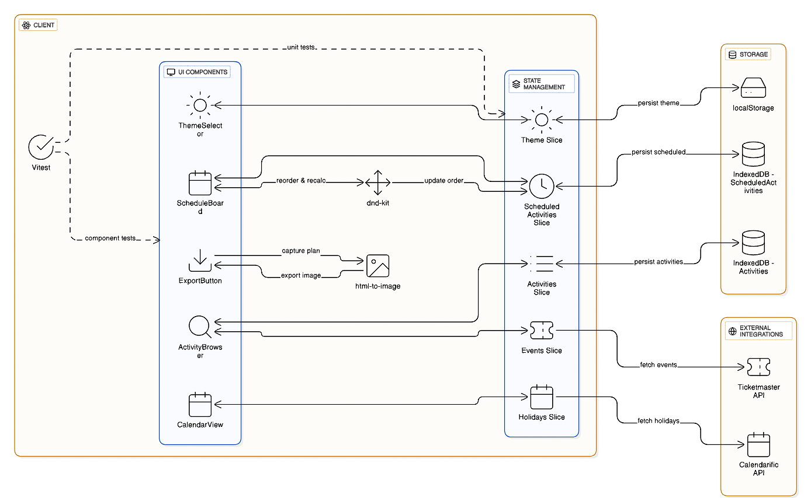

# Weekendly (Weekend Planner)

Weekendly is a **web application** that makes weekend planning **effortless, personalized, and engaging**.  
Users can explore mood-based activities, schedule them into a weekend timeline, reorder them with drag-and-drop, and even extend weekends intelligently with holiday awareness.  

---

## 🚀 Features

- **Mood-Based Browsing** – Explore activities by *Adventure, Lazy, Family* moods.  
- **Scheduling** – Add activities into weekend days with specific times.  
- **Drag-and-Drop** – Reorder activities seamlessly with auto time recalculation (via `dnd-kit`).  
- **Holiday Awareness** – Extend weekends with bridging (Thu/Fri/Mon/Tue) using **Calendarific API**.  
- **Event Discovery** – Discover upcoming events via **Ticketmaster API**.  
- **Export Plan** – Save weekend plan as a **shareable image** (`html-to-image`).  
- **Persistence & Offline** – Activities and schedules stored in **IndexedDB**, theme stored in **localStorage**.  
- **Responsive UX** – Mobile-first design with lazy loading for performance.  

---

## 🏗️ Architecture



Weekendly is structured around:  
- **UI Components** – React components for browsing, scheduling, and exporting.  
- **State Management** – Redux Toolkit slices: *activities, scheduledActivities, holidays, events, theme*.  
- **Persistence** – IndexedDB (activities/schedules), localStorage (theme).  
- **External APIs** – Ticketmaster for events, Calendarific for holidays.  

---

## ⚙️ Tech Stack

- **Frontend**: React (Vite) + TailwindCSS  
- **State Management**: Redux Toolkit  
- **Persistence**: IndexedDB, localStorage  
- **Drag-and-Drop**: dnd-kit  
- **Exporting**: html-to-image  
- **APIs**: Ticketmaster API, Calendarific API  
- **Testing**: Vitest + React Testing Library  

---

## 📦 Installation & Setup

Clone the repository and install dependencies:

```bash
git clone <your-repo-link>
cd weekendly
npm install
npm run dev